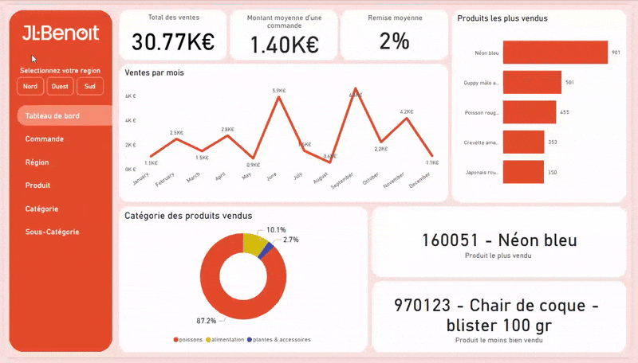
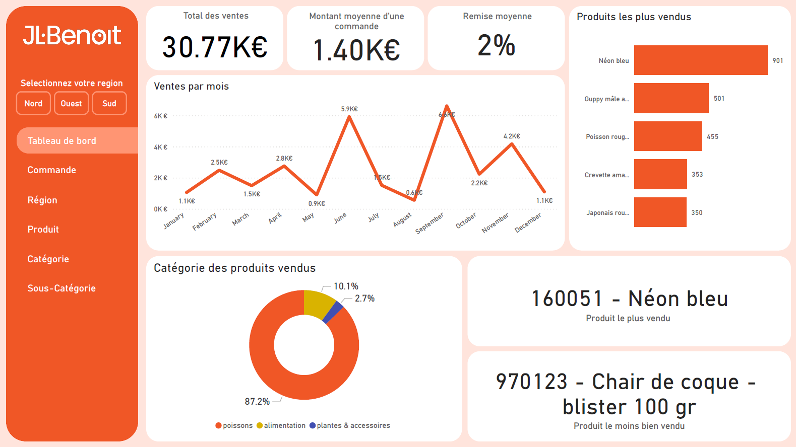
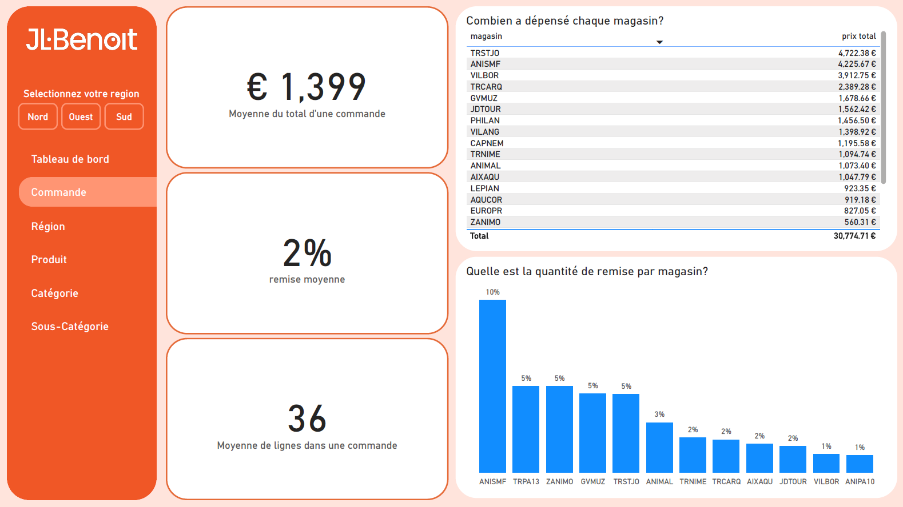
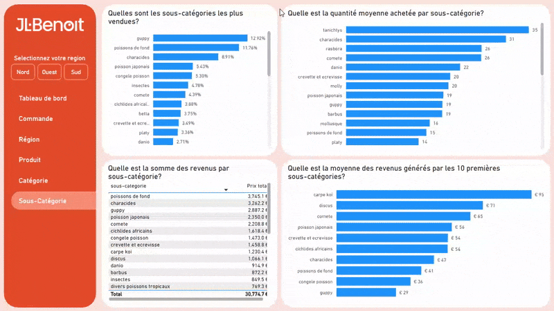

# 📂 My Power BI sales Dashboard Portfolio 

This repository showcases my Power BI dashboard project and documents my learning journey, from building this report to designing advanced, interactive analytics. **The goal of this project is to transform raw data into visuals that communicate real meaning.**

🕵️ *Looking for my dashboard? It's [here](images/cpe_dashboard_bi.pdf)*
# Why sales? And why... fish?.. 🐠

To build something both functional and realistic, I chose to focus on an environment I know well: *tropical aquarium fish wholesale.* 🐟\
Drawing on my experience as a sales assistant in a French exotic fish wholesaler company, I created a dashboard **that mirrors real operational needs.** The metrics, structure, and insights are designed to reflect what would genuinely be useful to my former managers. 

#### *<ins>A word on the data:</ins>*
*For confidentiality reasons, I am not sharing the CSV or Excel data files.
The dataset was fabricated but based on the structure, references, and systems used by my previous employer. I also kept the dataset and dashboard in French, as this portfolio is intended for opportunities within France.*

# The needs
This dashboard was built to provide managers with fast, meaningful, and interactive insights. Its core objectives were to:

#### 1. Present essential KPIs clearly:
- *Total sales.*
- *Median sale per customer.*
- *Average discount rate.*

#### 2. Support dynamic exploration:
- *Filter results by region.*
- *Interact with visuals to uncover patterns.*

#### 3. Reveal trends and performance drivers:
- *Sales over time.*
- *Product, category, & sub-category performance.*

#### 4. Offer deeper detail when needed with dedicated pages for:
- *Regional results.*
- *Order level details.*
- *Product metrics.*

 
 

# 📊 Data Model (ERD)
To structure the dataset effectively, I designed a schema and built an Entity Relationship Diagram (ERD) to clarify relationships and ensure efficient querying. 

# 🔍 The dashboard 
 
The design centers on a responsive left side pane that allows users to quickly navigate to detail pages via interactive buttons and bookmarks, all while continuously displaying key  data.

The detailed pages are designed for comprehensive and granular data analysis.
These views allow users to investigate key details, such as which discounts benefit specific stores, the total amount spent by the store, and the quantity of item lines included in each order.

 

The true power of this dashboard lies in its **interactivity** using Power BI's features.
Users can interact with specific data points, such as clicking on the "Characidés" sub-category to **instantly sync and filter all other visuals across the report**, enabling rapid and efficient extraction of granular data.

# ⚒️ Key Power BI Skills Used

- 🎨 Advanced Dashboard Layout & Design (UI/UX & Optimization): Crafting an intuitive and visually appealing report layout.
- 🔗 Data Modeling: Building efficient data models with relationships (Star Schema principles).
- ⚙️ Power Query ETL: Performing data cleaning, shaping, and transformation.
- 🧮 Implicit Measures, Standard Aggregations, & Explicit DAX Measures (CALCULATE, context modifiers, etc).
- 📊 Core Charts (Bar, Line, Column, Pie)
- 🔢 KPI Cards: To highlight key performance indicators.
- 🖱️ Interactive Slicers: Enabling dynamic, user driven data filtering.
- 🔘 Buttons & Bookmarks: For streamlined navigation and managing report views.

# Conclusion
This project pulls together dynamic visuals and multi-layered analysis to create a streamlined reporting experience. It helps managers access high value insights quickly while still offering deeper analytical pages when needed.

Whether exploring performance at a high level or looking into specific product lines, **the dashboard is optimized to support data driven decision making.**

# 🤔 Takeaways / What I've learned
Using Power BI was intuitive, having previously used Excel and Adobe programs such as Illustrator and Photoshop. Working on this project mainly allowed me to strengthen my Power BI skills:

- I learned the basics of Power BI and the logic that structures this tool.
- I became familiar with creating visuals and shaping data into easy to understand insights.
- I discovered the strength of Power Query to efficiently sort, filter, and clean rows of data, making information clearer and more actionable.
- I learned to use DAX to write and run more complex queries for more insightful visuals.

 
 

*So Long, and Thanks for All the Fish*